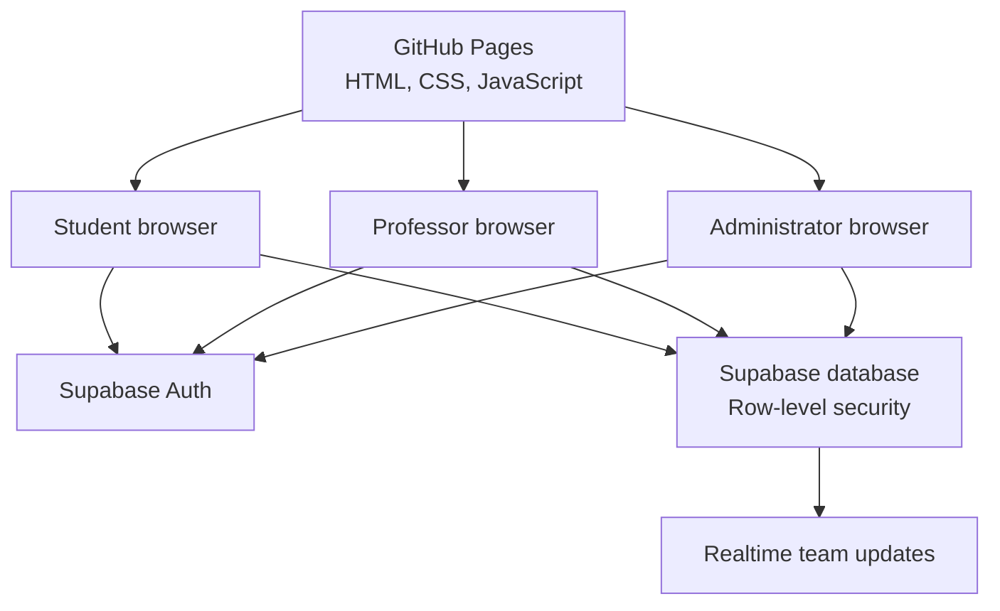
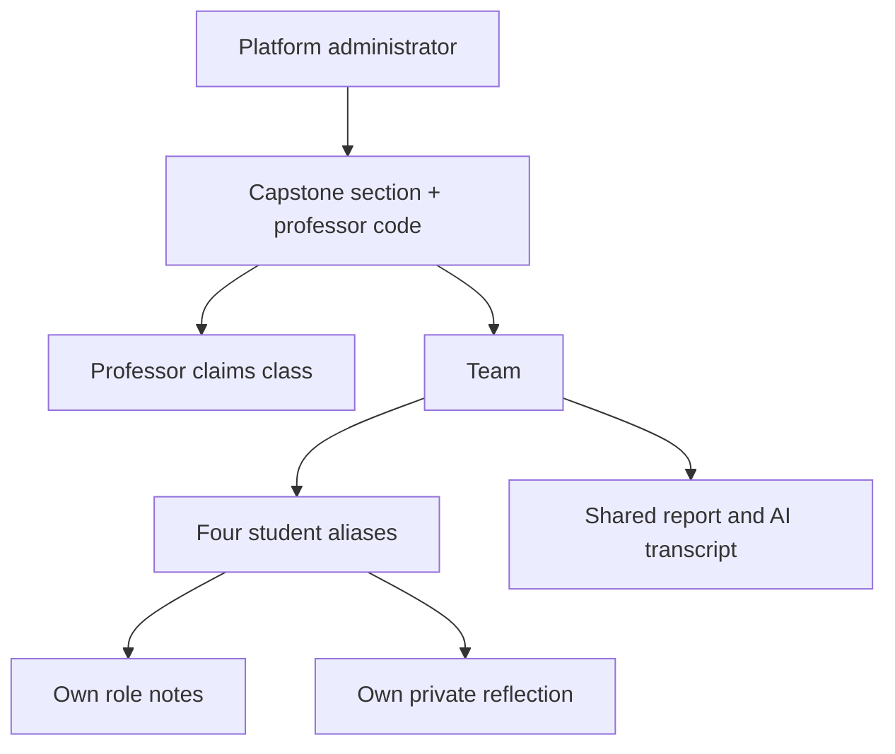

# Architecture

## System overview

CoolHack is a static HTML, CSS, and JavaScript application hosted on GitHub
Pages. Supabase provides the optional live classroom.

GitHub Pages is public and cannot safely hold secrets. The browser receives a
public Supabase project URL and publishable key. Supabase authentication and
database row-level security determine what each signed-in user may read or
change.

## Authorization hierarchy

- The platform administrator can manage all sections.
- A professor uses the administrator-issued professor code to claim one active,
  unassigned class and can manage only that class.
- The professor shares the separate student section code with that class.
- One student creates a team with the section code; the other three members join
  with the generated private team code.
- A student can access only that joined team.
- Teammates can see one another's aliases and role notes.
- A student's reflection is not visible to teammates; authorized staff can
  review it.

## Main files

| File | Purpose |
|---|---|
| `index.html` | Missions, evidence, glossary, browser-only workspace, and page shell |
| `classroom.js` | Authentication, dashboards, live classroom, saving, and subscriptions |
| `classroom.css` | Live-classroom interface and responsive styles |
| `supabase-config.js` | Public project URL and publishable key |
| `supabase/schema.sql` | Original database foundation |
| `supabase/nickname-auth-migration.sql` | Nickname account compatibility |
| `supabase/admin-sections-migration.sql` | Administrator, professors, and section isolation |
| `supabase/self-service-professor-migration.sql` | Code-based professor claims and access audit |

## Data model

| Table | Stores |
|---|---|
| `profiles` | Display name and application role |
| `sections` | Section name, professor access code, student section code, assigned professor, and active state |
| `teams` | Student-chosen team name, private team code, section, mission, and lock state |
| `team_members` | Student-to-team membership and assigned role |
| `role_notes` | One student's notes for one team mission |
| `team_reports` | Shared findings, timeline, decision, unknowns, AI transcript, and feedback |
| `reflections` | One student's private reflection for one mission |
| `access_events` | Recent successful role-based sign-ins visible to the administrator |

## Authentication model

Supabase authentication uses email/password credentials internally.

- The administrator uses one real, dedicated project email for recovery.
- A professor supplies a private class code and username; the application
  derives a stable, non-deliverable internal identifier and atomically assigns
  the matching class.
- A student supplies a team code and invented screen name; the application
  derives a stable, non-deliverable internal identifier.

The derived identifier is not a substitute for a password. Each person must
create a unique CoolHack-only password.

## Trust boundaries

- **Public:** source code, missions, public browser keys, and documentation.
- **Protected by Supabase:** accounts, aliases, memberships, reports, notes,
  reflections, and role assignments.
- **Private and external:** answer keys, grading keys, real rosters, grades, and
  any mapping between aliases and students.

Do not attempt to hide private material in HTML, JavaScript, comments, branches,
or unlinked URLs. If it is in a public repository or public Pages deployment,
assume students can retrieve it.
